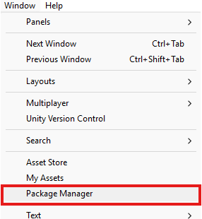
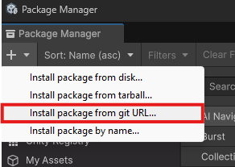

# Utils Unity Package
## Description
I created this Unity package to help me in my various projects.  
I often stumbled upon repeating senarios where I needed a script for a specific mechanic but which is also often required when developing a game (a character controller, a menu system etc.).
Facing this "issue" of copying scripts from other projects (which is not really an issue but maybe a **threat** to the [DRY principle](https://en.wikipedia.org/wiki/Don%27t_repeat_yourself) at a larger scale), I decided to learn how to make a Unity package!

## Installation
> **1. Access the Unity Package Manager in Unity by clicking on `Window` > `Package Manager`.** 

> **2. Click on the `+` button and select `Add package from git URL...`.**

> **3. Paste the following URL in the input field: `https://github.com/AdriKat2022/UtilsUnityPackage.git`**

> **4. Click on `Install`**

> **5. Profit!**

## About the code
Part if the goal of this package is to provide scripts that are easy to use and understand. But also to get better at writing code that is clean, efficient, maintainable and documented.

### Rules I follow for this development
Here are the rules I believe are great to follow when writing code that I abide to for this package:
- **Strict naming convention**: Private fields are prefixed with an underscore, public fields and methods are PascalCase, and local variables are camelCase.
- **Consistent code style**: The code's indentation and braces placement is kept consistent.
- **Well placed comments**: Comments are used to explain the code's purpose, and to provide additional information when necessary. The code is kept to be as self-explanatory as possible.
- **Code documentation**: Public methods and fields are documented.
- **Encapsulation**: Fields are kept private and accessed through properties when necessary. I always avoid to have direct references to minimize spaghetti code! I therefore tend more to use events and delegates actions for callbacks.
- **Efficiency**: I attempt to write code that is efficient and optimized. I avoid unnecessary operations and try to keep the code as clean as possible.
- **Unity API usage**: I try to use the Unity API in the most efficient way possible. I avoid using `Update()` when it's not necessary, and I use `OnEnable()` and `OnDisable()` when needed.
- **DRY principle**: I use inheritance, interfaces or composition accordingly and other OOP principles to keep the code clean and maintainable.
- **No magic numbers**: Using magic numbers in the code is close to banned. I use constants or serialized fields instead to keep the code extra flexible from the inspector.

### Unity Editor
> ***[Section Coming Soon]***

## Content
Currently, there isn't much for the majority of games. But I intend to make this package grow in power and make it as much handy as possible.  
With care and patience, it will even be really useful for production!  

For the moment, here are the current contents of this package.

### Debugging
- **LiveLogger class**: Allows easy log display inspired by the UnrealEngine logging system. Offers a new log feedback layer by unclogging the Unity console for specific logs, or straight up if the Unity console is unavailable.

### Code Patterns
- **Singleton class**: A simple Singleton pattern implementation.
- **SingletonThreadSafe class**: A simple Singleton pattern implementation safer when using threading.

### Text Animations
*Various ready-to-use text animations.*  
*These scripts have a pretty much highly tweakable with many options serialized in the editor.*  
- **RainbowTextMeshProGUI class**: Highly tweakable rainbow effect for UI text.  
- **RainbowTextMeshPro class**: Highly tweakable rainbow effect for 3D text.  

### Scripted Animations (UI & 3D)
*Various ready-to-use animations for UI components (anything that has a RectTransform) or for 3D objects.*  
- **ButtonAnimation class**: Script providing animations like scaling and rotating upon different button events. 
- **Camera Shake class**: Smart shaking effect that can be used on any Transform, usually the camera. Provides many options to tweak the shake effect.

### UI Elements
- **HoldAction class**: Script that allows to trigger an action when holding a button for a certain amount of time. Provides many options to tweak the holding visual effect.
- **SimpleTimer class**: Simple timer that can be used to display a count-up (and a countdown comming soon). Format is automated.

### Others
- **Mathematics class**: Various math utilities (currently only a method to map a value from a range to another).